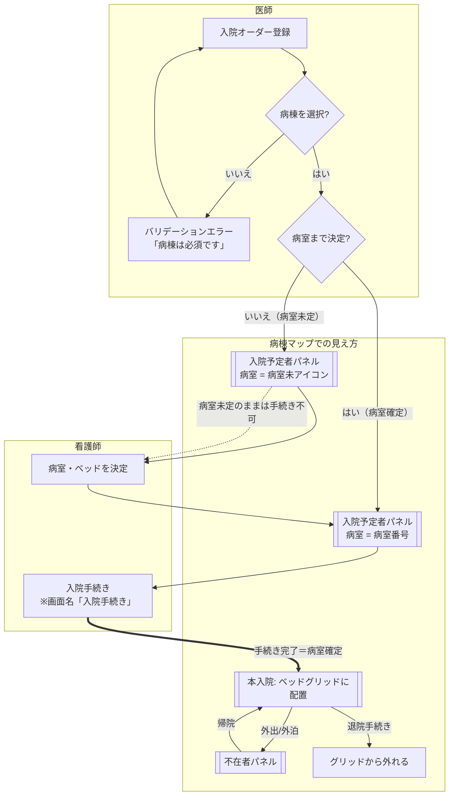
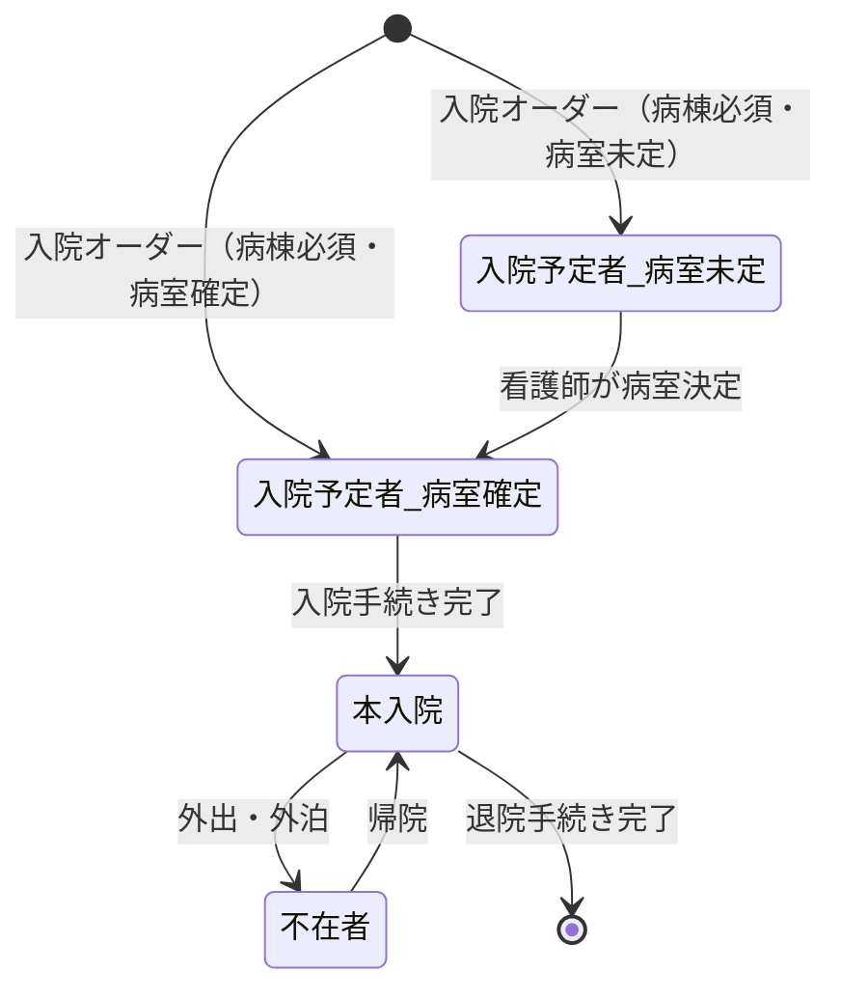

# 病棟マップ 画面設計書（右サイドバー再設計）

## メタ

| 項目 | 内容 |
| --- | --- |
| 画面パス | `/` |
| 主要コンポーネント | `src/components/wardMap/WardMap.tsx`、`src/components/wardMap/WardMapSidebar.tsx` |
| 対応エピック | [ep-01](../../../specs/ep-01-bed-map/_epic.md) |
| 対応ストーリー | us-01（病床表示）／ us-03（ベッド割当） |
| 対応 spec | [us-01-bed-display.spec.md](../../../specs/ep-01-bed-map/us-01-bed-display.spec.md) |
| 対応 API 設計書 | api/ep-01-bed-map/admission-orders.md（整備予定） |
| 対応ロール | 主治医・病棟看護師（入院オーダーは医師、病室決定・入院手続きは看護師。本フローに事務は関与しない） |
| ステータス | draft |

## 概要

病棟マップ右サイドバーの情報パネルを再設計する。現行は「未割当者 / 入院予定 / 不在者 / 入院者情報」の 4 パネルで、未割当者だけが病棟横断（全体）スコープ、他は病棟別という不統一があった。

本再設計では **「入院オーダー時に病棟を必須にする（バリデーションあり）」** を前提に置く。これにより「病棟未割当」という状態が原理的に消滅し、残る未確定は **病室未割当のみ** となる。結果として未割当者パネルは不要になり、**全パネルを「選択中病棟」スコープに統一**できる。

> 設計判断: 通常運用は「病棟は必ず決まり、病室割当まで」で完結するため、この箇所は参考システムの画面構成に厳密準拠せず、当院運用に合わせて表示を簡素化する（整合が取れないことを許容する）。

## 用語整理

| 旧 | 新 | 定義 |
| --- | --- | --- |
| 未割当者 | （廃止） | 病棟未割当が無くなるためパネルごと削除 |
| 仮病棟（チェック） | 病室未定 | ダイアログの「仮病棟」は実態が病室・ベッド未定。病棟は常に確定するため名称を是正 |
| 入院予定 | 入院予定者 | 入院オーダー済・入院手続き前。病室は決定済 or [病室未] |
| （在床患者） | 本入院 | 入院手続き完了＝病室確定済。ベッドグリッドに配置 |
| 不在者 | 不在者 | 本入院のうち外出・外泊中 |

## 入院ライフサイクル（フローチャート）

役割境界（医師 / 看護師 / 事務）と、病棟マップ上の見え方を 1 枚に示す。



### フローの要点

- **病棟は医師のオーダー時に必須**。未選択は登録できない（バリデーション）。
- **病室は医師オーダー時点で未定でも可**。未定の場合は入院予定者パネルに `[病室未]` で表示し、看護師が後から病室を決定する。
- **入院手続きの完了時点では病室が確定している**ことを前提とする（＝本入院は必ずベッドを持つ）。したがって「本入院だが病室未割当」という宙に浮く患者は発生しない。
- 病室未定のまま入院手続きには進めない（手続きの前提条件 = 病室確定）。
- 帰院・退院でグリッド上の在床状態が出入りする。

> 担当境界: 「病室決定」「入院手続き」はいずれも**看護師**が実施する。**事務はこのフローに関与しない**。「入院手続き」は画面名でもある（看護師が操作する画面）。看護師が病室を確定してから入院手続きを行うため、手続き完了時点では病室が必ず確定している。

## 患者状態モデル（病棟マップ視点）



各状態は **病棟が必ず確定している**ため、すべて病棟別（選択中病棟）で表示できる。

## 画面構成（右サイドバー）

### レイアウト（再設計後）

選択中病棟（上部の病棟切替に連動）について、3 パネルを縦に並べる。

```
┌─────────────────────────────┐
│ ■ 入院予定者(n名)   第N病棟  │
│   氏名   予定日  [病室番号]  │  ← 病室確定: 色=割当済
│   氏名   予定日  [病室未]    │  ← 病室未定: 色=未割当
├─────────────────────────────┤
│ ■ 不在者(n名)       第N病棟  │
│   氏名               [詳細]  │
├─────────────────────────────┤
│ ■ 入院者情報        第N病棟  │
│   病床 nn / nn               │
│   患者 / 不在者 / 在院者      │
│   平均年齢（男/女/全）        │
└─────────────────────────────┘
```

### コンポーネント分割

| コンポーネント | パス | 役割 |
| --- | --- | --- |
| `WardMap` | `src/components/wardMap/WardMap.tsx` | 画面ルート。病棟切替・ベッドグリッド・右サイドバー配置 |
| `WardMapSidebar` | `src/components/wardMap/WardMapSidebar.tsx` | 右サイドバー 3 パネル（本設計の主対象） |

### 表示要素

| 要素 | 役割 | データソース | スコープ | 表示条件 |
| --- | --- | --- | --- | --- |
| 入院予定者パネル | 入院オーダー済・手続き前の患者 | `ADMISSION_ORDERS`＋`pendingOrders`（`type='入院'`、`status` 手続き前、`wardId === ward`） | 選択中病棟 | 常時（0 件は「なし」） |
| ─ 予定日 | 入院予定日 | `scheduledDate` | | 各行 |
| ─ 病室バッジ | 病室の決定状況 | `roomNumber`（`'—'`/未設定 → `[病室未]`、それ以外 → 病室番号） | | 各行。未/済を色＋アイコンで判別 |
| 不在者パネル | 外出・外泊中の在床患者 | `PATIENTS.filter(wardId===ward && status==='outing')` | 選択中病棟 | 常時 |
| 入院者情報パネル | 病床稼働・性別・平均年齢の集計 | その病棟の `ROOMS`／`PATIENTS` 集計 | 選択中病棟 | 常時 |

### 削除する要素

- **未割当者パネル**（病棟横断「全体」スコープ）を削除。
- 削除に伴い、`WardMapSidebar` の `onOpenUnassigned` 経路と未割当者由来の `UnassignedPatientsPanel` 起動導線を整理する（病室未定患者は入院予定者パネルから扱う）。

## 状態管理

### グローバル state

| store / key | 用途 | 永続化 |
| --- | --- | --- |
| `useAppStore.pendingOrders` | 当該セッションで登録した入院/退院指示（未確定） | 既存どおり |

### 派生値（useMemo）

- `scheduledAdmissions`: `ADMISSION_ORDERS`＋`pendingOrders` から `type='入院'` かつ手続き前かつ `wardId === ward` を抽出。各要素に `roomDecided`（病室確定フラグ）を付与。
- `absent`: 選択中病棟 × `status==='outing'`。
- 入院者情報の集計（病床数・男女・平均年齢）は現行ロジックを踏襲。

## バリデーション

| 対象 | ルール | 実施層 |
| --- | --- | --- |
| 入院オーダーの病棟 | 必須。未選択時は登録不可・エラー表示 | フロント（オーダーダイアログ） |
| 入院手続き | 病室確定が前提（病室未定では手続き不可） | フロント＋（実装時）バックエンド |

## 連携 API（想定）

| 操作 | API | 備考 |
| --- | --- | --- |
| 入院予定者取得 | `GET /api/admission-orders?ward={wardId}&type=admission&status=pending` | 選択中病棟スコープ |
| 不在者取得 | `GET /api/patients?ward={wardId}&status=outing` | |
| 入院者情報集計 | `GET /api/wards/{wardId}/census` | 病床・男女・平均年齢 |
| 病室割当（看護師） | `PATCH /api/admission-orders/{id}/room` | 病室未定 → 確定 |

## 補足・残課題

- 「両病棟の入院予定を 1 画面で俯瞰する」用途は、入退院情報画面の入院予定カレンダー（`AdmissionScheduleCalendar`）が担う。病棟マップ側では持たない方針で確定。
- `UnassignedPatient` 型・`UNASSIGNED_PATIENTS` モックには `designatedWardId: 'tentative'`（病棟未割当）の例（U003）が含まれる。本設計では該当ケースが消滅するため、モック整備時に病棟確定へ寄せるか、入院予定者へ統合する。
- 入院オーダーダイアログの「仮病棟」チェックは「病室未定」に名称・意味を是正する（別タスク）。
</content>
</invoke>
